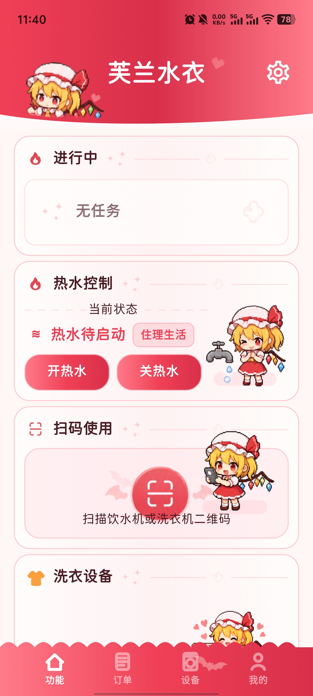
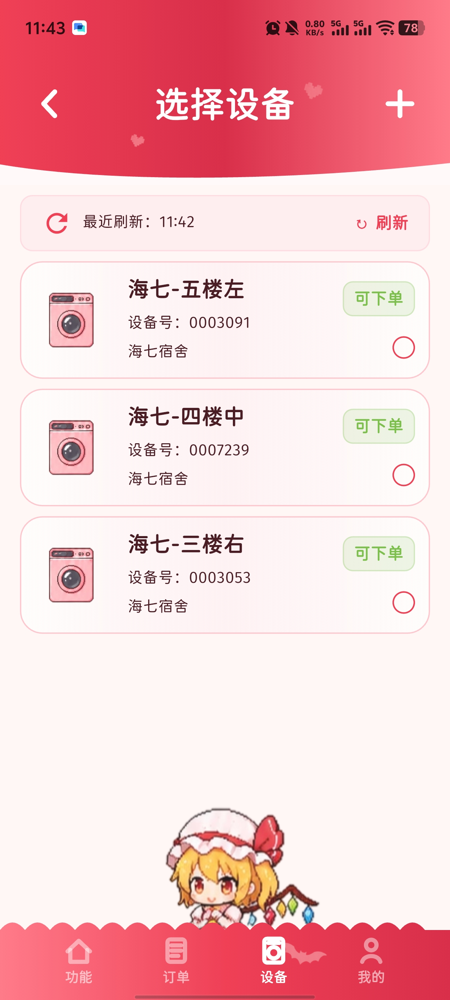
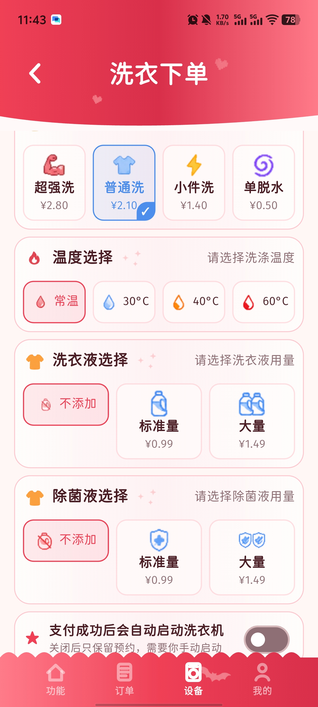

<p align="center">
  
</p>

# 芙兰水衣 FlandreSY 2.0

`芙兰水衣`（FlandreSY）是一次面向真实使用场景的 Flutter 2.0 完全重构。它围绕校园/公寓生活中的洗衣、饮水、热水与 798 相关服务，重新整理了旧版 1.x 的交互、状态和发布链路，目标是做成一个更稳定、可维护、可跨平台演进的版本。

## 项目截图

<p align="center">
  
  
  
</p>


## 项目状态

- 应用显示名：`芙兰水衣`
- 英文品牌名：`FlandreSY`
- Android 包名：`com.flandresy`
- iOS Bundle ID：`com.flandresy`
- 正式版营销版本：`2.0.0`
- Flutter 构建版本：见 [pubspec.yaml](/home/arizmi1a/FlandreSY2.0/pubspec.yaml:4)
- 默认运行模式：真实后端

## 2.0 重构目标

- 统一 Android / iOS 的主业务体验
- 拆掉 1.x 中难维护的耦合和“大文件”问题
- 为真实接口、真机验证、发布分发和后续迭代留出清晰边界
- 在保留 legacy 行为语义的前提下，逐步替换 fake / demo 阶段逻辑

## 主要能力

- 洗衣流程：设备识别、下单、支付、订单状态与历史
- 饮水流程：扫码、创建订单、刷新状态、历史保留
- 热水流程：账号态、运行态、历史与真实 BLE 接入准备
- 798 流程：账号、设备与扩展接入骨架
- 更多选项：版本检查、诊断、权限与发布辅助能力

## 仓库结构

- `lib/`：Flutter 2.0 主代码
- `android/`：Android 工程与发布签名配置
- `ios/`：iOS 工程、Podfile 与发布配置
- `assets/legacy/`：从旧版整理出来并继续复用的图片/字体资源
- `public/`：对外发布用的版本清单
- `tools/release/`：发布辅助脚本
- `P_PLAN/`：规划、审查记录、发布清单与设计约束
- `docx/`：README 展示用截图资源

## 本地开发

```bash
flutter pub get
flutter analyze
flutter test
flutter run
```

默认走真实后端。若需要无账号、无设备的纯演示模式：

```bash
flutter run --dart-define=SIMULATE_BACKEND=true
```

## 版本与更新链路

- 内置离线版本清单：`public/version.json`
- 远端版本检查优先级：
  - `https://flandresy.pages.dev/version.json`
  - `https://raw.githubusercontent.com/amamiyakazuki/FlandreSY/main/public/version.json`
- GitHub Releases 下载页：
  - `https://github.com/amamiyakazuki/FlandreSY/releases/latest`

### Pages 部署说明

`flandresy.pages.dev` 是当前的主版本源。每次发版时需要把仓库根 `public/version.json` 同步部署到 Pages；如果 Pages 尚未刷新，应用会自动回退到 GitHub raw 版本清单。

部署后至少确认：
1. Pages 实际服务的是当前仓库根 `public/` 目录
2. `public/version.json` 的版本号、发布日期和下载链接都已经更新
3. 浏览器可以直接打开 `https://flandresy.pages.dev/version.json`

## Android 发布

1. 复制 `android/key.properties.example` 为 `android/key.properties`
2. 填入真实 keystore 路径、alias 与密码
3. 运行统一校验与构建脚本：

```bash
bash tools/release/build_android_release.sh
```

如果只想先检查签名配置是否齐全：

```bash
bash tools/release/build_android_release.sh --validate-only
```

说明：
- 仓库已经接好 release signing 自动读取逻辑
- `android/key.properties` 缺失时，Gradle 会回退到 debug signing，只能用于本地验证，不可正式分发
- 为保证 beta 用户可原地升级到正式版，Android `applicationId` 当前保持为 `com.flandresy`
- 对于 GitHub Releases 分发，当前更推荐把 `app-release.apk` 作为主安装包

## iOS 发布

- 仓库已包含 iOS 工程、Alipay 通道与 Podfile 配置
- 正式发布仍需在 macOS + Xcode + Apple Developer 环境完成签名、Archive 与 TestFlight / App Store 流程
- 若需验证当前 iOS 构建链路，请在 macOS 上执行：

```bash
flutter clean
flutter pub get
cd ios && pod install --repo-update
cd ..
flutter build ios --no-codesign --release
```

## 开源许可

This project is licensed under the GNU Affero General Public License v3.0. See [LICENSE](/home/arizmi1a/FlandreSY2.0/LICENSE:1) for details.
