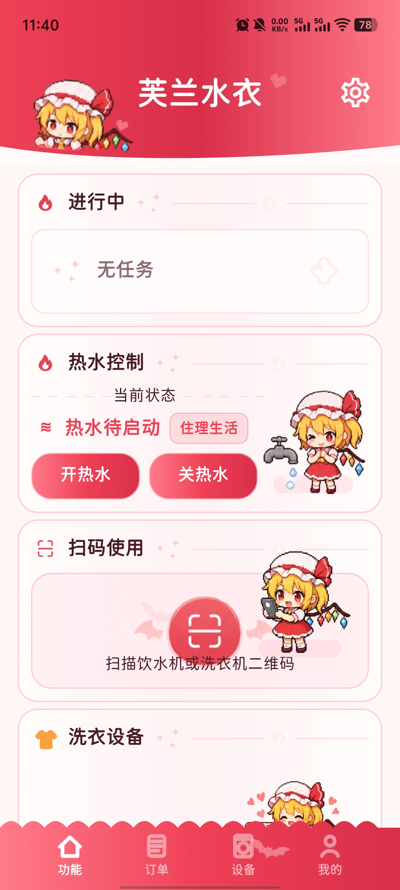
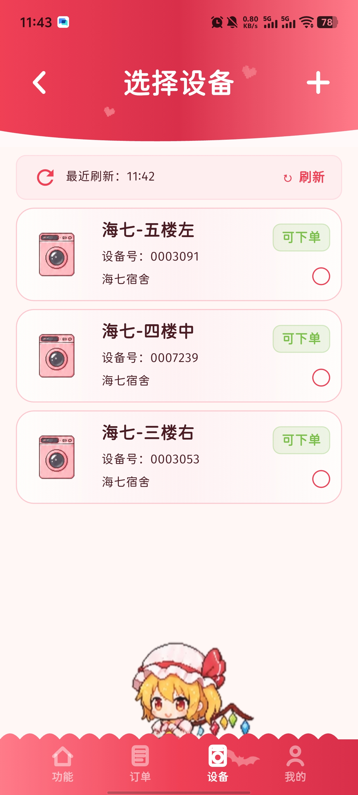
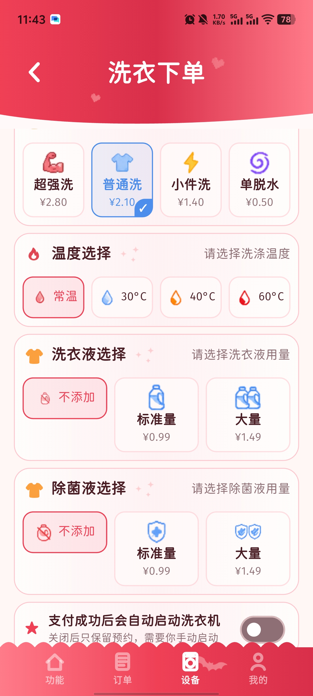

<p align="center">
  
</p>

# 芙兰水衣 FlandreSY 2.1.3

`芙兰水衣`（FlandreSY）是一款面向校园与公寓生活场景的 Flutter 应用，统一管理洗衣、饮水、热水与慧生活 798 服务。2.1 版本重点重构了页面动效、账号入口、订单状态恢复和在线更新链路。

## 项目截图

<p align="center">
  
  
  
</p>


## 项目状态

- 应用显示名：`芙兰水衣`
- 英文品牌名：`FlandreSY`
- Android 包名：`com.flandresy`
- iOS Bundle ID：`com.flandresy`
- 正式版营销版本：`2.1.3`
- Flutter 构建版本：见 `pubspec.yaml`
- 默认运行模式：真实后端

## 2.1.3 更新

- 修复热水双击重复启动，保留原会话时间和关水凭据；开关按钮保持可点击。
- 重启／回前台时，距开水超过 40 分钟恢复待开水并更新可用订单，未超过则保持已开水；该规则不代表设备自动关水。
- 加强账号切换与过期响应隔离，避免饮水、洗衣活动订单被覆盖或丢失。
- 完善订单持久化、损坏数据保留、网络超时和 BLE 连接处理。
- Debug 与正式版可共存；新增 Android CI，自动分析、测试和构建 Debug APK。

正式安装包：[FlandreSY 2.1.3 Release](https://github.com/amamiyakazuki/FlandreSY/releases/tag/v2.1.3)。优先下载 `app-release.apk`（ARM64 与 x86_64，不含 32 位 ARM）。

已有用户升级请沿用上版的文件类型；架构专用包改装主 APK 可能被系统判为降级，请从 Release 页面选择相同架构的专用包，不要卸载后重装。

## 2.1 系列能力

- 统一页面、弹窗、列表和操作反馈的动效节奏
- 增加统一账号中心，并明确住理生活、慧生活 798 与 U净的状态
- 持久化热水会话和饮水订单，恢复应用后继续核对状态
- 在“更多选项”中在线检查版本并直接打开 APK 下载地址

## 主要能力

- 洗衣流程：设备识别、下单、支付、订单状态与历史
- 饮水流程：扫码、创建订单、刷新状态、历史保留
- 热水流程：账号、设备、手动开关、40 分钟恢复规则、历史与真实 BLE 接入
- 798 流程：账号、设备选择、手动洗浴控制与会话恢复
- 更多选项：在线更新、诊断日志、权限检查与设备列表导入导出

## 仓库结构

- `lib/`：Flutter 2.0 主代码
- `android/`：Android 工程与发布签名配置
- `ios/`：iOS 工程、Podfile 与发布配置
- `assets/legacy/`：从旧版整理出来并继续复用的图片/字体资源
- `assets/public/`：应用内置及远程读取的版本清单
- `tools/release/`：发布辅助脚本
- `P_PLAN/`：规划、审查记录、发布清单与设计约束
- `docx/`：README 展示用截图资源

## 本地开发

```bash
flutter pub get
flutter analyze
flutter test
flutter run
```

默认走真实后端。若需要无账号、无设备的纯演示模式：

```bash
flutter run --dart-define=SIMULATE_BACKEND=true
```

## 持续集成（CI）

`.github/workflows/flutter-android-ci.yml` 在分支 push、PR 和手动触发时顺序执行：

1. 使用 Flutter 3.44.4、JDK 17 和已提交的 `pubspec.lock` 安装依赖。
2. `flutter analyze --no-pub` 与全量 `flutter test --no-pub --reporter expanded`。
3. 构建 Android ARM64 Debug APK；前面的检查失败则不构建、不上传。
4. 将 APK 保存为 `flandresy-debug-arm64-<run_id>-<run_attempt>`，保留 7 天。

推送后在 GitHub 仓库 **Actions → Flutter Android CI → 对应运行 → Artifacts** 下载并解压 APK。手动运行入口需工作流先存在于默认分支。本配置不发布 GitHub Release、不读取正式签名密钥、不执行真实支付或 BLE 操作；现有 iOS 工作流保持独立、不在本轮修改。

APK 包名为 `com.flandresy.debug`，可与正式版共存，但托管 runner 的临时 Debug 签名不保证与本机或其它次构建相同；不能保证覆盖现有 Debug 安装。不要为安装测试包贸然卸载仍有活动订单的旧版本，卸载会丢失其本地数据。默认真实后端，安装后控制设备或付款仍会产生真实效果。

本工作流提供检查结果，但尚未配置分支保护的强制合并门禁。失败先看对应步骤日志；无需为重试 CI 再次操作真实设备。Action 版本锁定到 commit SHA；升级时同时核对 Flutter、Android SDK/NDK 与 AGP 的兼容要求。

参考：[Flutter Action](https://github.com/subosito/flutter-action)、[AGP 9.0 兼容表](https://developer.android.com/build/releases/agp-9-0-0-release-notes)、[GitHub Artifacts](https://github.com/actions/upload-artifact)。

## 版本与更新链路

- 内置版本清单：`assets/public/version.json`
- 远端版本清单：`https://raw.githubusercontent.com/amamiyakazuki/FlandreSY/main/assets/public/version.json`
- GitHub Releases 下载页：
  - `https://github.com/amamiyakazuki/FlandreSY/releases/latest`

发版时需同步更新 `pubspec.yaml` 与 `assets/public/version.json`，并确保清单中的下载地址指向已经上传的 GitHub Release asset。

## Android 发布

本地安装验证可以直接构建 release 模式 APK：

```bash
flutter build apk --release
```

如果没有 `android/key.properties`，Gradle 会明确打印 `debug fallback (local verification only)`；该 APK 只用于本地验证，不能作为正式分发包。

正式发布使用下面的脚本。它会先校验版本、签名文件、Dart 分析和全量测试，再生成正式签名 APK/AAB：

1. 复制 `android/key.properties.example` 为 `android/key.properties`
2. 填入真实 keystore 路径、alias 与密码
3. 运行统一校验与构建脚本：

```bash
bash tools/release/build_android_release.sh
```

当前 Flutter SDK 的正式 Android 构建目标为 `android-arm64` 与 `android-x64`；脚本会生成这两种 split APK、包含两种架构的 `app-release.apk` 和 AAB。

如果只想先检查签名配置是否齐全：

```bash
bash tools/release/build_android_release.sh --validate-only
```

说明：
- 仓库已经接好 release signing 自动读取逻辑
- 发布脚本强制使用正式 keystore；`android/key.properties` 缺失时会在构建前失败
- 为保证 beta 用户可原地升级到正式版，Android `applicationId` 当前保持为 `com.flandresy`
- 对于 GitHub Releases 分发，当前更推荐把 `app-release.apk` 作为主安装包

## iOS 发布

- 仓库已包含 iOS 工程、Alipay 通道与 Podfile 配置
- 正式发布仍需在 macOS + Xcode + Apple Developer 环境完成签名、Archive 与 TestFlight / App Store 流程
- 若需验证当前 iOS 构建链路，请在 macOS 上执行：

```bash
flutter clean
flutter pub get
cd ios && pod install --repo-update
cd ..
flutter build ios --no-codesign --release
```

## 开源许可

This project is licensed under the GNU Affero General Public License v3.0. See `LICENSE` for details.
